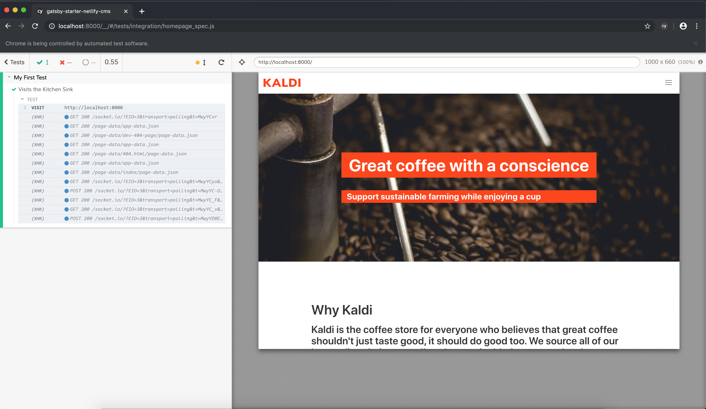

# Set up a Demo site

[This is a good place to start](https://www.gatsbyjs.org/starters/?v=2)

----

Install `cypress`

```bash
yarn add -D cypress
```

----

Open Cypress

```json
...
"scripts": {
  ...
  "cypress": "cypress open"
  ...
}
```

```bash
yarn cypress
```

---

## First test - home page

```javascript
// cypress/integration/homepage_spec.js

describe('My First Test', function() {
    it('Visits the Home Page', function() {
        cy.visit('http://localhost:8000');
    });
});
```

---



---
`cy.contains('...')`

```javascript
describe('My First Test', function() {
    it('Visits the Home Page', function() {
        cy.visit('http://localhost:8000');

        // Find the title
        cy.contains('Great coffee with a conscience');
        
        // Find the subtitle
        cy.contains('Support sustainable farming while enjoying a cup');

    });
});
```

---

## Click

```javascript
it('Clicks on the "About" link', () => {
    cy.visit('http://localhost:8000');

    cy.contains('About').click();

    cy.contains('About our values');
});
```

----

## Suny Day

```javascript
it('Sunny day test', () => {
    cy.visit('http://localhost:8000');

    cy.contains('About').click();
    cy.contains('About our values');

    cy.contains('Products').click();
    cy.contains('Our Coffee');

    cy.contains('Products').click();
    cy.contains('Our Coffee');

    cy.contains('Blog').click();
    cy.contains('Latest Stories');

    cy.contains('Contact').click();
    cy.contains('Your name');
    
    cy.contains('Form Examples').click();
    cy.contains('Hi people');
});
```
----

## Default assertions

- `cy.visit()` expects the page to send text/html content with a 200 status code.
- `cy.request()` expects the remote server to exist and provide a response.
- `cy.contains()` expects the element with content to eventually exist in the DOM.
- `cy.get()` expects the element to eventually exist in the DOM.
- `.find()` also expects the element to eventually exist in the DOM.
- `.type()` expects the element to eventually be in a typeable state.
- `.click()` expects the element to eventually be in an actionable state.
- `.its()` expects to eventually find a property on the current subject.

---

```html
<div className="control">
  <input
    className="input"
    type="text"
    name="name"
    onChange={this.handleChange}
    id="name"
    required
    data-test-id="name"
  />
</div>
```

----

## Functional Test

```javascript
describe('Contact Form', () => {
    it('Should behave correctly', () => {
        cy.visit('http://localhost:8000/contact');

        cy.get('input').should('have.length', 4)
        cy.get('textarea').should('have.length', 1)

        cy.get('[data-test-id="name"]').should('have.length', 1).type('Jonh Doe')
        cy.get('[data-test-id="email"]').type('JonhDoe@home.com')
        cy.get('[data-test-id="message"]').type('Lorem ipsum dolor sit amet, consectetur adipiscing elit, sed do eiusmod tempor incididunt ut labore et dolore magna aliqua. Ut enim ad minim veniam, quis nostrud exercitation ullamco laboris nisi ut aliquip ex ea commodo consequat. Duis aute irure dolor in reprehenderit in voluptate velit esse cillum dolore eu fugiat nulla pariatur. Excepteur sint occaecat cupidatat non proident, sunt in culpa qui officia deserunt mollit anim id est laborum.')
        cy.get('[data-test-id="send-btn"]').click();

        cy.contains('Thank you!');

    });
});
```